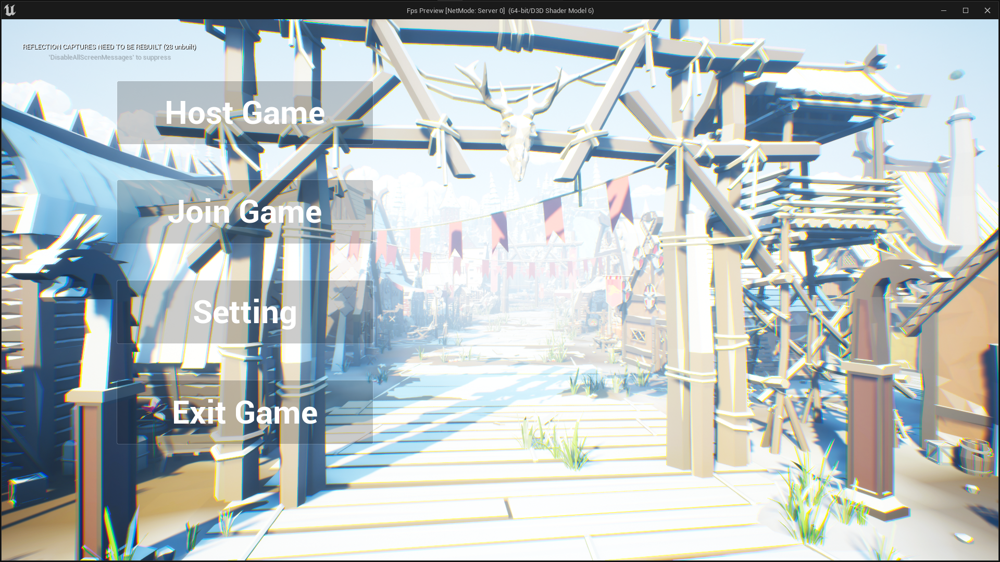

<h2>Kraver 프로젝트</h2>

Kraver 프로젝트는 언리얼 엔진5의 `OnlineSubsystem Steam`을 사용한 멀티플레이 FPS 입니다.  

[실행 영상](https://youtu.be/DNDqj0rVHR4)

---

<h3>기술 스택</h3>

---

<table align="center">
    <tr align="center">
        <td style="font-weight: bold; padding-right: 10px; vertical-align: center;">
            언어
        </td>
        <td>
                
        </td>
    </tr>
        <tr align="center">
        <td style="font-weight: bold; padding-right: 10px; vertical-align: center;">
        게임 엔진
        </td>
        <td>
           
        </td>
    </tr>
</table>

<h2>메인 메뉴</h2>

"Host Game" 버튼을 눌러 세션을 생성하고 생성된 세션을 호스팅합니다.  
"Join Game" 버튼을 눌러 세션을 찾고 찾은 세션에 참가합니다.  
"Setting" 버튼을 눌러 설정창을 엽니다.  
"Exit Game" 버튼을 눌러 게임을 종료합니다.

---

<h3>설정창</h2>

.png)
.png)

"Apply" 버튼은 변경 사항이 있을 경우 활성화됩니다.  
또한 "Apply" 버튼을 눌러 변경 사항을 적용할 수 있습니다.

