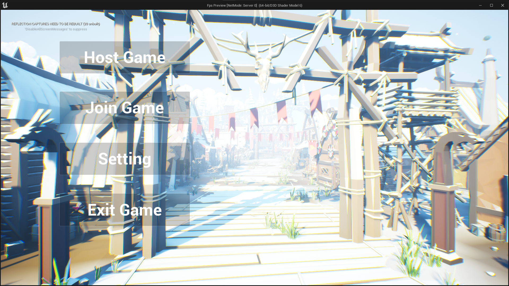

[한국어 문서](https://github.com/BIGSUNGG/FPS/blob/main/README-ko.md)

<h2>Kraver Project</h2>

Kraver project is Unreal Engine5 Multiplay Fps with `OnlineSubsystem Steam`

[Execution Video](https://youtu.be/DNDqj0rVHR4)

---

<h3>Languages and Tools</h3>

---

<table align="center">
    <tr align="center">
        <td style="font-weight: bold; padding-right: 10px; vertical-align: center;">
            Language
        </td>
        <td>
                
        </td>
    </tr>
        <tr align="center">
        <td style="font-weight: bold; padding-right: 10px; vertical-align: center;">
        Game Engine
        </td>
        <td>
           
        </td>
    </tr>
</table>

<h2>Main Menu</h2>

You can create a session and host the session by pressing "Host Game" button.  
You can find a session and join the session by pressing "Join Game" button.  
You can open the settings menu by pressing "Setting" button.  
You can shutdown the game by pressing "Exit Game" button.

---

<h3>Settings Menu</h2>

.png)
.png)

The "Apply" button is enabled when there are any changes,  
and you can apply changes by pressing "Apply" button.
